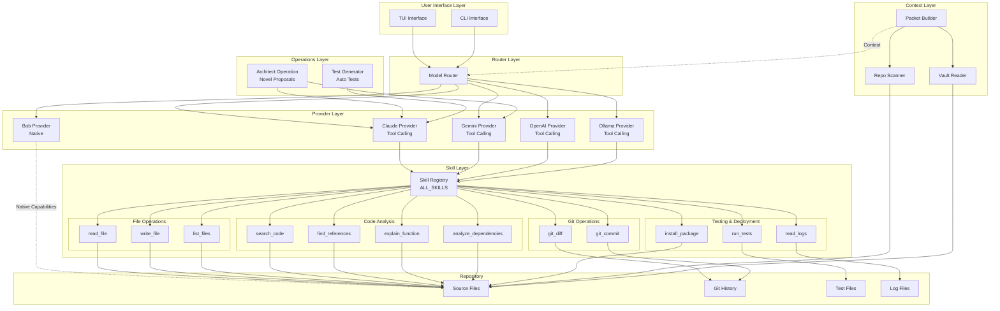
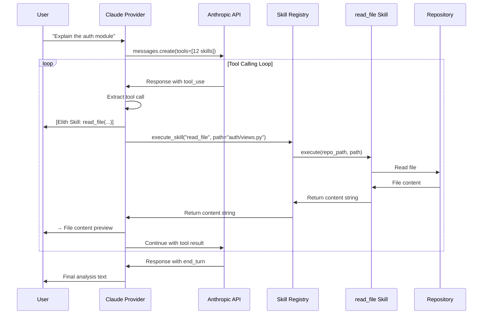
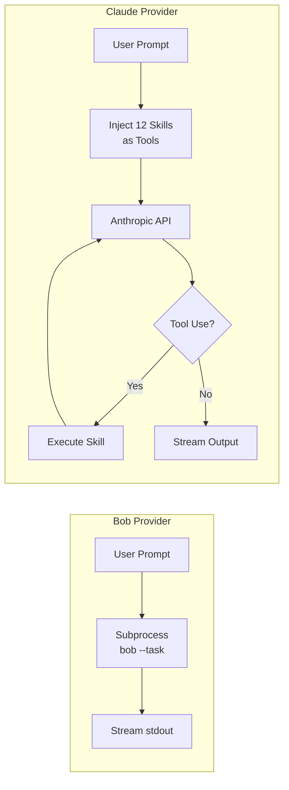
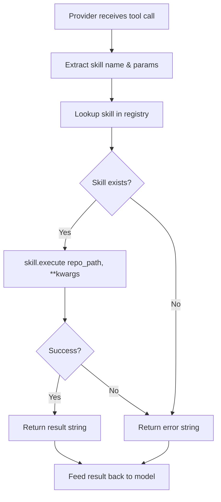
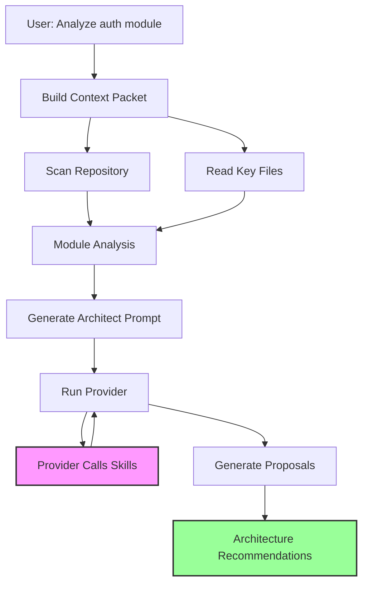
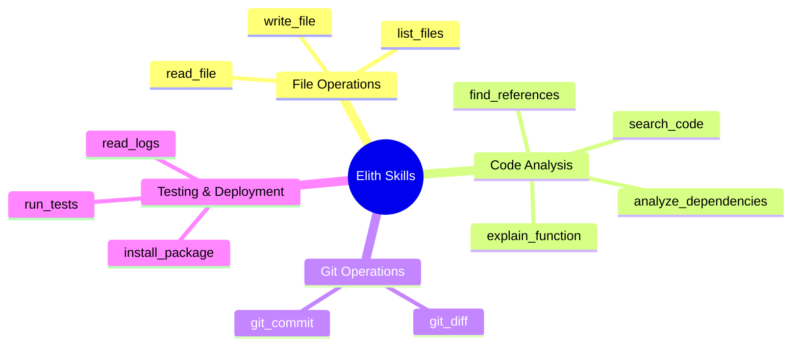
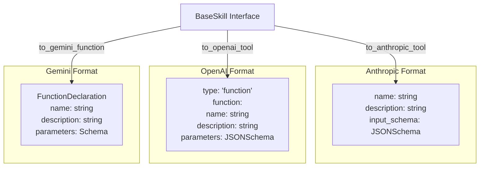
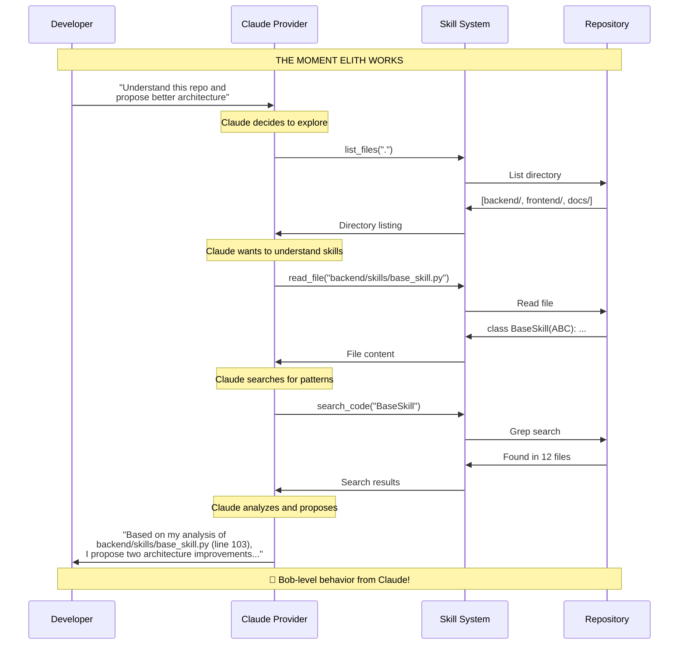

# Elith System Architecture

## High-Level Overview

## Tool Calling Flow

## Provider Comparison

## Skill Execution Pattern

## Data Flow: Architect Operation

## Skill Categories

## Provider Tool Format Differences

## Critical Path Dependencies

```mermaid
gantt
    title Elith Implementation Timeline
    dateFormat HH
    axisFormat %H
    
    section Foundation
    BaseSkill & BaseProvider :crit, base, 02, 2h
    
    section Core Skills
    read_file (CRITICAL) :crit, read, after base, 1h
    write_file :write, after read, 1h
    list_files :list, after read, 1h
    search_code :search, after read, 1h
    
    section Bob Provider
    Investigate Bob shell :crit, bob_inv, after base, 1h
    Implement Bob Provider :bob, after bob_inv, 2h
    
    section Remaining Skills
    8 Additional Skills :skills, after search, 3h
    Skill Registry :registry, after skills, 1h
    
    section Claude Provider
    Claude Implementation :crit, claude, after registry, 3h
    Claude Testing :crit, claude_test, after claude, 2h
    Gemini Implementation :gemini, after claude, 2h
    
    section Other Providers
    OpenAI Provider :openai, after gemini, 2h
    Ollama Provider :ollama, after gemini, 2h
    
    section Operations
    Architect Design :arch_design, after claude, 2h
    Architect Implementation :arch, after arch_design, 3h
    Test Generator :testgen, after arch, 2h
    
    section Integration
    Router Integration :router, after ollama, 2h
    Integration Testing :int_test, after router, 3h
    
    section Demo
    Demo Preparation :demo, after int_test, 4h
    
    section Polish
    Code Review & Docs :polish, after demo, 4h
```

## The Critical Moment

---

## Key Architectural Principles

### 1. Abstraction Through Base Classes
- **BaseSkill**: Defines contract for all skills
- **BaseProvider**: Defines contract for all providers
- Enables adding new skills/providers without changing existing code

### 2. Tool Calling Normalization
- Each provider has different tool calling API
- BaseSkill provides conversion methods for each format
- Providers use appropriate conversion method

### 3. Streaming Output Pattern
- All providers return `Generator[str, None, None]`
- Enables real-time output display
- Supports long-running operations

### 4. Error Handling Contract
- Skills MUST return `str` (even for errors)
- Format: `"Error: description"`
- Providers don't catch skill exceptions
- Skills handle their own error cases

### 5. Repository-Centric Design
- All operations relative to `repo_path`
- Skills receive `repo_path` as first parameter
- Enables working with any repository

### 6. Provider Loop Pattern
- Non-standard: must loop on `tool_use`
- Execute skill, append result, continue
- Break only on `end_turn` or equivalent

---

*Elith Architecture Diagram - IBM Bob Hackathon 2026*